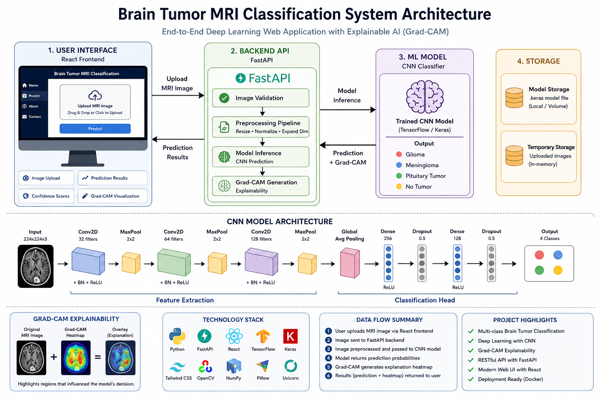

# 🧠 Brain Tumor MRI Classification using Deep Learning

An end-to-end deep learning application for automated brain tumor classification from MRI images using TensorFlow/Keras, FastAPI, React, and Grad-CAM explainability.

---

##  Overview

This project classifies brain MRI scans into four diagnostic categories:

- Glioma
- Meningioma
- Pituitary Tumor
- No Tumor

The system combines a custom Convolutional Neural Network (CNN) with an interactive web application that allows users to upload MRI scans and receive:

- Predicted tumor class
- Prediction confidence
- Class probability distribution
- Grad-CAM visual explanation of the model's decision

---

##  Features

- Custom CNN built with TensorFlow/Keras
- MRI image preprocessing and normalization
- Data augmentation pipeline
- FastAPI REST API
- React + Tailwind CSS frontend
- Grad-CAM explainability
- Sample MRI prediction
- Interactive confidence visualization
- Deployment-ready project structure

---

##  Project Structure

```text
Brain_Tumor_MRI_Classification/
│
├── backend/
├── frontend/
├── models/
├── notebooks/
├── sample/
├── screenshots/
├── requirements.txt
├── docker-compose.yaml
├── README.md
└── .gitignore
```

---

##  Model Architecture

The classifier consists of:

- Data Augmentation
- Conv2D (32 filters)
- Batch Normalization
- MaxPooling
- Conv2D (64 filters)
- Batch Normalization
- MaxPooling
- Conv2D (128 filters)
- Batch Normalization
- MaxPooling
- Global Average Pooling
- Dense (256)
- Dropout
- Dense (128)
- Dropout
- Output Layer (4 Classes)

---

##  Classes

| Class | Description |
|--------|-------------|
| Glioma | Brain Glioma Tumor |
| Meningioma | Meningioma Tumor |
| Pituitary | Pituitary Tumor |
| No Tumor | Normal Brain MRI |

---

##  Explainable AI

The project integrates **Gradient-weighted Class Activation Mapping (Grad-CAM)** to highlight the regions of the MRI scan that most influenced the model's prediction, improving transparency and interpretability.

---

##  Tech Stack

- Python
- TensorFlow / Keras
- FastAPI
- React
- Tailwind CSS
- OpenCV
- NumPy
- Matplotlib
- Pillow

---

##  Running Locally

### Backend

```bash
cd backend
uvicorn app.main:app --reload
```

### Frontend

```bash
cd frontend
npm install
npm run dev
```

---

##  Application Preview

> 

### Home Page


### Prediction Result


### Grad-CAM Explanation


---

## 📖 Notebook

The complete training workflow is available in the `notebooks` directory and includes:

- Data preprocessing
- CNN development
- Training
- Evaluation
- Confusion matrix
- Classification report
- Grad-CAM visualization

---

## 🔮 Future Improvements

- Transfer learning (ResNet50, EfficientNetB0, MobileNetV2)
- Hyperparameter optimization
- Multi-center MRI datasets
- Tumor segmentation
- Clinical decision support integration

---

## 👨‍💻 Author

**Badawi Aminu Muhammed**

AI/ML Engineer • Data Scientist • Research Analyst

GitHub: https://github.com/E-badawy
